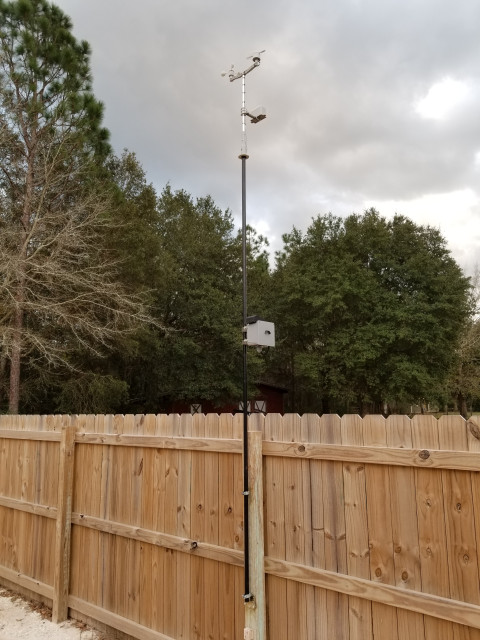

# The Quest for a Reliable, Robust, Repairable Raspberry Pi-based Weather Station
Project Initialized October 2019.
Project opened to public on Github February 2020.

My station is up and running.  It works.  I get good, accurate, stable readings for temperature, pressure, humidity, wind speed, wind direction.  The tipping bucket rain gauge works, but my code is still incomplete for rainfall. 

Here's what's where:  (remember: this is all in progress still)

- **Code**: contains the Python3 code in the 'out' folder.  Also contains 'The_Code_is_what_it_is.md' which provides some details on the soft side of the project.
- **Component_Docs**: contains collected documentation for the various hardware pieces of the station.
- **Pics**: contains pictures of the pieces and parts (640x480).  Contact me if you want higher resolution pics.
- **SKP_STL**: contains the Sketchup and stereolithography files for the 3D printed parts I designed for this project.
- **Station_Assembly_Docs**: contains documents pertaining to the actual assembly of the station.  

This is not a quick-and-easy project.  The station itself is powered by a remote 12VDC power supply with a battery backup.  I dug a trench, put PVC conduit in it, and pulled 14AWG Romex into it.  It's a good, cheap(ish) solution.  I drove ground rods and put in-line lighting/surge protectors on both ends of that power run.  I used a power supply made for controlled access doors.  A benefit of doing that is it has a timed relay built in.  By routing the 12V output of the supply through that relay, I have a way to remotely power-cycle (reboot) the station.  This has been VERY handy during this development stage.

The whole Weather Station package is really two computers.  The station acquires data from the sensors, makes necessary calculations and stores that data via WiFi to a mySQL server running in my house.  That machine also serves data to end-users using Python/Flask/Jinja/Gunicorn and nginx (webserver).  Video from the Pi Camera gets sent to my Zoneminder system. That video can be viewed directly from the station using a web browswer, but I already had Zoneminder going, so it just made sense to incorporate the feed from the WeatherPi.

No guarantees are made. None. This project is actively underway, and changes can occur at any time.

I do not <b>yet</b> have a complete parts list for you.  Nor do I have step-by-step instructions.  I'm just a guy, not a foundation, who loves to make things that work.  Then I like to share them with others who might benefit from a bit of data I happen to share.

### A bit of History

After throwing away my second Acurite weather station in only two years I decided I would build my own.  It may be cheaper to buy a more expensive commercial brand like Davis, but honestly, I'm sick of the throw-away culture when I can do something about it.

The goal of this project is to take advantage of the availability of the modular Pi and Arduino sensors and boards to create a weather station that I could repair when something died.  The Pi lives on the pole with the sensors, and communicates over WiFi.

The project is being written in Python 3. Everything stays here, this is not ever going to be on the web, although I do intend to eventually upload data to a PWS site like [this one](https://www.pwsweather.com/). 

I am making every attempt to provide enough documentation and schematics for anyone else to duplicate what I've done.

I am a self-taught rank amateur coder, as anyone with experience can plainly see.  What I know is what I've done so far works here, and provides me with reliable and accurate data as compared to all the local commercial and government data sources.  

I use Visual Studio Code in Windows.  I use Microsoft's Remote-SSH extensions to work with my code on the weather station Pi out on the pole in the backyard.
I use Filezilla to keep local copies of that code when I'm done editing and testing.

The system runs on a Pi 4 Model B.  Rather than re-invent the wheel on environmental sensors, I bought [Sparkfun's SEN-08942 Weather Meters](https://www.sparkfun.com/products/8942). I have a [DROK buck-converter](./Pics/DROK-Buck-Converter-mount.jpg) DC-to-DC power board, a real-time clock module, a analog-to-digital module, and a BME280 temperature, pressure, humidity sensor module all living in the box on the pole.  A Pi Camera v2 provides a 640x480 view of the outdoor conditions.  

I own a Prusa MK3S 3D printer which I use to make mounts and other custom parts for assembling the whole thing.  Unlike many people who seem to think you can't use Sketchup for modeling for printing, I do it all the time with no problem.  The .skp and .stl files are here for you to use as you see fit.

